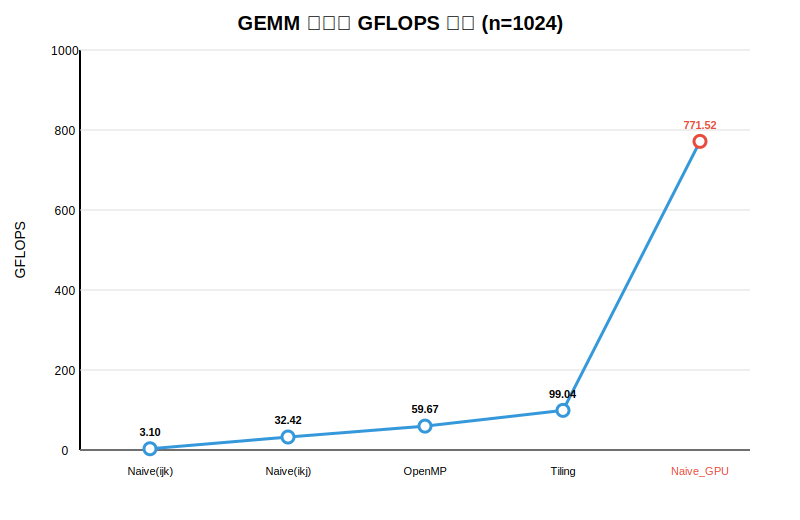

# GEMM 性能优化研究

矩阵规模：`n = 1024`（1024×1024 单精度浮点矩阵乘法）

## 项目结构

```text
GEMM-research/
├── cpu/              # CPU 版本【已完成】
│   ├── src/          
│   │   ├── naive_ijk.cpp
│   │   ├── naive_ikj.cpp
│   │   ├── openmp.cpp
│   │   └── tiling.cpp
│   ├── include/      # CPU 头文件
│   └── main.cpp      # CPU 统一测试入口
├── gpu/              # GPU 版本【敬请期待】
│   ├── src/          
│   ├── include/      # GPU 头文件
│   └── main.cu       # GPU 测试与验证入口
├── common/
│   └── utils.h       # 公共工具：矩阵初始化、验证、计时、GFLOPS 计算
├── docs/
│   ├── GEMM_GFLOPS_chart.svg   # 性能对比图表
│   ├── cpu_gflops.xlsx         # Month 4 Excel 审计点 (TODO)
│   └── nsys_timeline.png       # Week 13 nsys 截图 (TODO)
├── scripts/
│   └── run_nsys.sh   # 自动化 nsys profile 脚本
├── .gitignore
└── README.md
```

## 折线图



> 提示：在浏览器中直接打开 `docs/GEMM_GFLOPS_chart.svg` 即可查看高清图表。

## 对比数据

| 版本 | 时间 (S) | GFLOPS |
|------|----------|--------|
| Naive(ijk) | 0.692892 | 3.10 |
| Naive(ikj) | 0.066232 | 32.42 |
| OpenMP | 0.035987 | 59.67 |
| Tiling | 0.021683 | 99.04 |

## 说明

- **Naive(ijk)**：最基础的三重循环实现，按 i-j-k 顺序遍历，缓存不友好，性能最低。
- **Naive(ikj)**：调整循环顺序为 i-k-j，提高了空间局部性，性能提升约 10 倍。
- **OpenMP**：在 Naive(ikj) 基础上使用 OpenMP 多线程并行（4 线程），性能再提升约 1.8 倍。
- **Tiling**：分块 + OpenMP + SIMD 向量化，充分利用缓存和寄存器，性能最高，约为最慢版本的 32 倍。

## IDE 配置

项目使用 `compile_flags.txt` 配置 clangd（VS Code 等编辑器的 C++ 语言服务），内容仅为 `-I.`，让 IDE 从项目根目录解析 `#include "common/utils.h"` 等头文件：

```text
-I.
```

如打开项目后头文件仍报红色波浪线，尝试重启clangd（VS Code: `Ctrl+Shift+P` → **clangd: Restart**）。

## 编译与运行

### 环境要求

- GCC 或 Clang（支持 C++11）
- OpenMP 支持（`openmp` 和 `tiling` 版本需要 `-fopenmp` 编译选项）
- CUDA Toolkit（GPU 版本需要）

### CPU 统一入口

```bash
cd /home/Flux/Project  # 项目根目录
g++ -fopenmp -O3 -march=native -I. cpu/main.cpp cpu/src/naive_ijk.cpp cpu/src/naive_ikj.cpp cpu/src/openmp.cpp cpu/src/tiling.cpp -o cpu_gemm
./cpu_gemm
```

### GPU 入口（CUDA）

```bash
nvcc -I. gpu/main.cu -o gpu_gemm
./gpu_gemm
```

### 使用 nsys 抓取性能报告

```bash
./scripts/run_nsys.sh ./cpu_gemm
# 或
./scripts/run_nsys.sh ./gpu_gemm
```

> 运行后终端会直接输出最小运行时间、对应的 **GFLOPS** 值以及结果验证状态。
