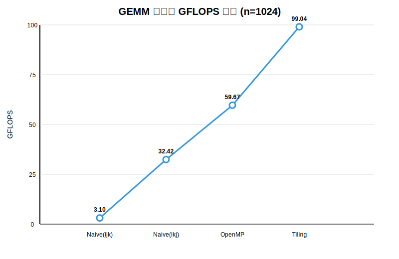

# GEMM 各版本 GFLOPS 对比

矩阵规模：`n = 1024`（1024×1024 单精度浮点矩阵乘法）

## 折线图



> 提示：在浏览器中直接打开 `show/GEMM_GFLOPS_chart.svg` 即可查看高清图表。

## 对比数据

| 版本 | 时间 (S) | GFLOPS |
|------|----------|--------|
| Naive(ijk) | 0.692892 | 3.10 |
| Naive(ikj) | 0.066232 | 32.42 |
| OpenMP | 0.035987 | 59.67 |
| Tiling | 0.021683 | 99.04 |

## 说明

- **Naive(ijk)**：最基础的三重循环实现，按 i-j-k 顺序遍历，缓存不友好，性能最低。
- **Naive(ikj)**：调整循环顺序为 i-k-j，提高了空间局部性，性能提升约 10 倍。
- **OpenMP**：在 Naive(ikj) 基础上使用 OpenMP 多线程并行（4 线程），性能再提升约 1.8 倍。
- **Tiling**：分块 + OpenMP + SIMD 向量化，充分利用缓存和寄存器，性能最高，约为最慢版本的 32 倍。

## 编译与运行

### 环境要求

- GCC 或 Clang（支持 C++11）
- OpenMP 支持（`openmp` 和 `tiling` 版本需要 `-fopenmp` 编译选项）

### naive_ijk（基础串行，i-j-k）

```bash
g++ -O3 -march=native naive_ijk.cpp -o naive_ijk
./naive_ijk
```

### naive_ikj（串行，i-k-j，缓存优化）

```bash
g++ -O3 -march=native naive_ikj.cpp -o naive_ikj
./naive_ikj
```

### openmp（4线程并行）

```bash
g++ -fopenmp -O3 -march=native openmp.cpp -o openmp
./openmp
```

### tiling（分块优化）

```bash
g++ -fopenmp -O3 -march=native tiling.cpp -o tiling
./tiling
```

> 运行后终端会直接输出最小运行时间和对应的 **GFLOPS** 值。
